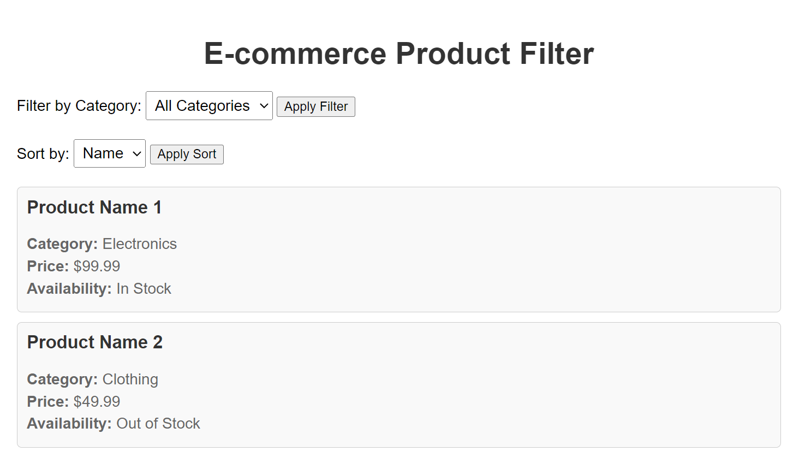

### 🌟 Exercise 3: E-commerce Product Filter

**Overview**:
In this exercise, you'll develop an e-commerce product filter application using Redux Toolkit. The application will maintain information about various products, including their names, categories, prices, and availability.

**Set up Redux Store**:

1. **Create Redux Store**: Begin by establishing a Redux store with necessary middleware and reducers to manage the product inventory state. Install Redux Toolkit (`@reduxjs/toolkit`) using npm or yarn if you haven't already. The Redux store acts as the central hub for managing product data.

   - **Folder**: `src`
   - **File**: `store.js`
   - **Dependencies**: `@reduxjs/toolkit`

   **Explanation**: Setting up the Redux store ensures efficient state management for the product inventory. Redux Toolkit simplifies this process, providing a structured approach to managing application state.

**Define Initial State**:

2. **Set Initial State**: Define the initial state with an array of products, each containing properties like id, name, category, price, and inStock. Utilize Redux Toolkit's `createSlice` function to define the initial state structure efficiently.

   - **Folder**: `src/features/products`
   - **File**: `productsSlice.js`

   **Explanation**: Defining the initial state establishes a baseline for managing product data. Redux Toolkit's `createSlice` reduces boilerplate code and enhances readability, making it easier to manage complex data structures.

**Selectors Creation**:

3. **Create Selectors**: Utilize `createSelector` from `@reduxjs/toolkit` to create selectors for filtering products based on categories, price ranges, and availability. Selectors streamline data querying and filtering, improving performance and maintainability.

   - **Folder**: `src/features/products`
   - **File**: `productSelectors.js`

   **Explanation**: Selectors abstract away the logic for filtering products based on various criteria, enhancing code maintainability and readability. By separating concerns, selectors simplify data retrieval and manipulation.

**Component Implementation**:

4. **Implement ProductList Component**: Develop a React component named `ProductList` responsible for rendering the product inventory. Components play a crucial role in presenting data to users and handling user interactions. Ensure React (`react`) and React Redux (`react-redux`) are installed.

   - **Folder**: `src/components`
   - **File**: `ProductList.js`
   - **Dependencies**: `react`, `react-redux`

   **Explanation**: The ProductList component serves as the visual representation of the product inventory. By encapsulating this functionality within a reusable component, we promote code reusability and maintainability.

**UI Interaction**:

5. **Implement UI Interactions**: Incorporate UI interactions within the ProductList component to demonstrate selector functionality. This involves updating the UI dynamically based on user actions, such as selecting categories, price ranges, or availability.

   - **Folder**: `src/components`
   - **File**: `ProductList.js`

   **Explanation**: UI interactions enhance the user experience by allowing users to filter and explore products based on their preferences. By integrating Redux with React components, we ensure seamless state management and UI updates.

**Bonus**:

6. **Implement Sorting Functionality**: As a bonus task, implement sorting functionality to allow users to sort products based on different criteria such as price, name, or availability. This enhancement adds further usability to the application, empowering users to find products more efficiently.

   **Explanation**: Sorting functionality enhances the user experience by providing additional flexibility in exploring and comparing products. By allowing users to sort products based on their preferences, we improve usability and user satisfaction.

**Test and Validate**:

7. **Test Functionality**: Validate the functionality by testing different scenarios, including filtering products based on categories, price ranges, availability, and sorting them based on various criteria. Testing ensures that the application behaves as expected across various scenarios.

   **Explanation**: Testing guarantees the correctness and reliability of the product filter application, including the bonus sorting functionality. By thoroughly validating the functionality, we ensure a robust and bug-free user experience.

**End File Structure**:

Upon completing the exercise, the final file structure should adhere to the following organization:

```
src/
├── components/
│   └── ProductList.js
├── features/
│   └── products/
│       ├── productsSlice.js
│       └── productSelectors.js
└── store.js
```

This structured organization enhances clarity and maintainability, with components, reducers, selectors, and the Redux store neatly organized within the project directory.

**End Project Example**

