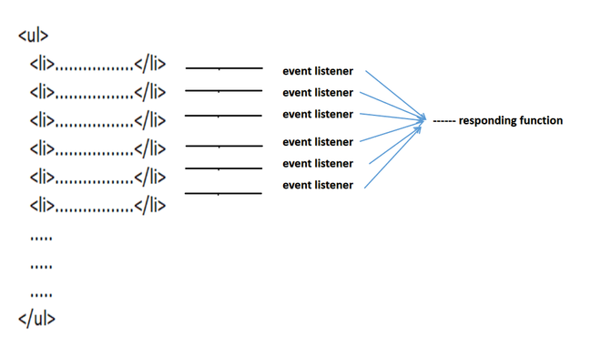

# Event Delegation

## Introduction

Event delegation is a powerful concept in JavaScript that allows you to handle events on multiple elements using a single event listener. This technique is particularly useful when dealing with dynamically generated content or a large number of similar elements. Instead of attaching an event listener to each individual element, you attach it to a common ancestor and use event propagation to handle events as they bubble up the DOM tree. In this comprehensive lesson, we'll delve deep into the intricacies of event delegation, understand its benefits, and explore practical examples to solidify our understanding.



## Understanding Event Delegation

### What is Event Delegation?

Event delegation is a technique in JavaScript where you attach a single event listener to a parent element to listen for events that occur on its child elements. Instead of adding event listeners directly to each child element, you leverage the concept of event bubbling to handle events efficiently.

### How Does Event Bubbling Work?

Event bubbling is the process where an event triggered on a child element propagates up through its ancestors in the DOM tree until it reaches the document root. During this propagation, each ancestor element has the opportunity to handle the event. Event delegation capitalizes on this bubbling behavior to handle events on multiple elements with a single event listener.

## Benefits of Event Delegation

### Simplified Event Management

Event delegation simplifies event management by reducing the number of event listeners in your code. Instead of attaching listeners to individual elements, you can attach a single listener to a common ancestor, leading to cleaner and more manageable code.

### Improved Performance

By delegating event handling to a parent element, you eliminate the need to attach multiple event listeners to numerous child elements. This can significantly improve performance, especially when dealing with large sets of elements or dynamically generated content.

### Dynamic Element Handling

Event delegation is particularly useful for handling events on dynamically generated content. Since the event listener is attached to a parent element that exists in the DOM from the start, it can handle events on dynamically added child elements without the need for additional setup.

## Implementing Event Delegation

Now, let's dive into practical examples to understand how to implement event delegation in JavaScript.

### Example 1: Click Event Delegation

Suppose you have a list of items, and you want to handle click events on each item. Instead of attaching a click event listener to each individual item, you can delegate the event handling to the parent `<ul>` element.

```html
<!DOCTYPE html>
<html lang="en">
  <head>
    <meta charset="UTF-8" />
    <meta name="viewport" content="width=device-width, initial-scale=1.0" />
    <title>Event Delegation Example</title>
  </head>
  <body>
    <ul id="item-list">
      <li>Item 1</li>
      <li>Item 2</li>
      <li>Item 3</li>
    </ul>

    <script>
      // Select the parent element
      const itemList = document.getElementById("item-list");

      // Add event listener to the parent element
      itemList.addEventListener("click", function (event) {
        // Check if the clicked element is an <li>
        if (event.target.tagName === "LI") {
          console.log("Clicked item:", event.target.textContent);
        }
      });
    </script>
  </body>
</html>
```

In this example, we attach a click event listener to the `<ul>` element (`itemList`). When a click event occurs, we check if the clicked element (`event.target`) is an `<li>` element. If it is, we log the text content of the clicked item.

### Example 2: Event Delegation with Dynamic Content

Now, let's extend our previous example to handle dynamically generated content.

```html
<!DOCTYPE html>
<html lang="en">
  <head>
    <meta charset="UTF-8" />
    <meta name="viewport" content="width=device-width, initial-scale=1.0" />
    <title>Dynamic Event Delegation</title>
  </head>
  <body>
    <button id="add-item">Add Item</button>
    <ul id="item-list">
      <!-- Existing list items -->
    </ul>

    <script>
      const itemList = document.getElementById("item-list");
      const addItemButton = document.getElementById("add-item");

      // Add event listener to the parent element
      itemList.addEventListener("click", function (event) {
        if (event.target.tagName === "LI") {
          console.log("Clicked item:", event.target.textContent);
        }
      });

      // Function to add a new item dynamically
      function addItem() {
        const newItem = document.createElement("li");
        newItem.textContent = "New Item";
        itemList.appendChild(newItem);
      }

      // Event listener for adding new item
      addItemButton.addEventListener("click", addItem);
    </script>
  </body>
</html>
```

In this example, we have a button (`addItemButton`) that dynamically adds new items to the list (`itemList`). The event delegation setup remains the same, allowing us to handle click events on both existing and dynamically added items seamlessly.

## Conclusion

Event delegation is a powerful technique in JavaScript for efficiently handling events on multiple elements. By attaching a single event listener to a parent element, you can streamline event management, improve performance, and seamlessly handle dynamically generated content. Understanding event delegation empowers you to write cleaner, more maintainable code and build richer interactive experiences on the web. Start leveraging the power of event delegation in your JavaScript projects today!
