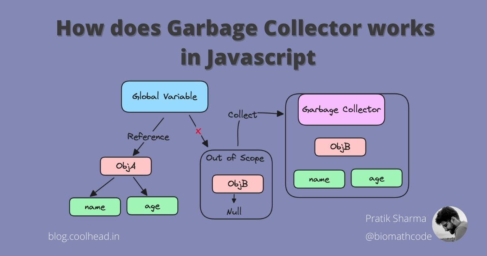
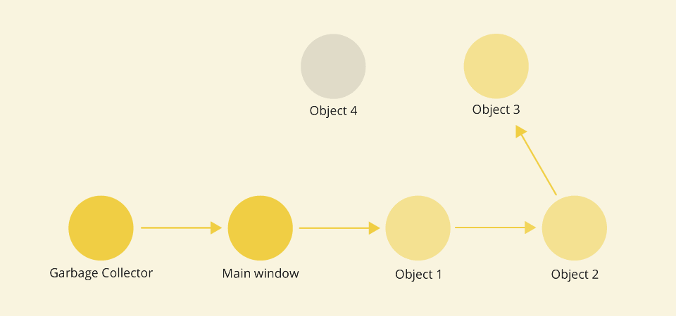

# Garbage Collection

## Introduction

Garbage collection is a fundamental aspect of memory management in JavaScript, responsible for reclaiming memory occupied by objects that are no longer in use. Understanding how garbage collection works is crucial for writing efficient and memory-conscious JavaScript code. In this comprehensive lesson, we'll delve deeper into the principles of garbage collection, explore common memory management pitfalls, and learn strategies to optimize memory usage in JavaScript applications.

## Understanding Garbage Collection



### What is Garbage Collection?

Garbage collection is the automatic process by which the JavaScript engine deallocates memory that is no longer needed or referenced by any part of the program. It plays a pivotal role in preventing memory leaks and ensuring efficient memory utilization in JavaScript applications.

### How Does Garbage Collection Work?

The JavaScript engine employs various garbage collection algorithms to identify and reclaim memory that is no longer in use. One common approach is the "mark-and-sweep" algorithm. Let's illustrate this with an example:

```javascript
function createObjects() {
  let obj1 = {};
  let obj2 = {};
  let obj3 = {};

  // Use objects...
}

createObjects();
```

In this example, when the `createObjects()` function is called, three objects are created. After the function execution completes, these objects are no longer reachable from any part of the program. During garbage collection, the JavaScript engine identifies these unreferenced objects and deallocates the memory they occupy.


### WeakMap and WeakSet

In JavaScript, `WeakMap` and `WeakSet` are specialized collections that are particularly useful for managing memory efficiently, especially in the context of garbage collection. These collections are "weak" because they hold references to objects weakly, allowing those objects to be garbage-collected when no other references to them exist.

### WeakMap

A `WeakMap` is a collection of key-value pairs where the keys are objects and the values can be any data type. The key objects are held weakly, which means they do not prevent the key objects from being garbage collected if there are no other references to them.

#### Features of WeakMap:

- **Weak references**: Keys in a `WeakMap` are held weakly, allowing them to be garbage collected.
- **No iteration**: `WeakMap` does not support methods like `keys()`, `values()`, and `entries()` for iteration, since it could expose the keys.
- **No clear() method**: There is no method to clear all key-value pairs, as it could retain references and prevent garbage collection.

#### Example of WeakMap:

```javascript
const weakMap = new WeakMap();

// Create an object key
const objKey = { name: "Object Key" };

// Set a value in the WeakMap
weakMap.set(objKey, "Some value");

// Retrieve the value using the object key
console.log(weakMap.get(objKey)); // Output: 'Some value'

// Remove the reference to the key object
objKey = null;

// At this point, the key can be garbage collected if there are no other references to it
```

### WeakSet

A `WeakSet` is a collection of unique objects (no primitive values) that are held weakly. Similar to `WeakMap`, the objects in `WeakSet` are held weakly, allowing them to be garbage collected when no other references to them exist.

#### Features of WeakSet:

- **Weak references**: Objects in a `WeakSet` are held weakly, allowing them to be garbage collected.
- **No iteration**: Like `WeakMap`, `WeakSet` does not support iteration methods, as it could expose the objects.
- **No clear() method**: There is no method to clear all objects, as it could retain references and prevent garbage collection.

#### Example of WeakSet:

```javascript
const weakSet = new WeakSet();

// Create an object
const obj = { id: 1 };

// Add the object to the WeakSet
weakSet.add(obj);

// Check if the object is in the WeakSet
console.log(weakSet.has(obj)); // Output: true

// Remove the reference to the object
obj = null;

// At this point, the object can be garbage collected if there are no other references to it
```

### Key Takeaways

- `WeakMap` and `WeakSet` are specialized collections that manage memory efficiently by holding weak references to objects.
- These collections are useful when you want to associate data with objects but do not want to prevent those objects from being garbage collected.
- They do not support iteration or clearing methods, as this would expose the internal structure and possibly prevent garbage collection.

By using `WeakMap` and `WeakSet`, you can write more memory-efficient JavaScript code, especially in complex applications with many objects and references.

## Memory Management Pitfalls

### Memory Leaks

_Example 1_

Memory leaks occur when objects that are no longer needed are still referenced, preventing them from being garbage collected. Let's consider an example:

```javascript
function createListener() {
  let element = document.getElementById("button");
  element.addEventListener("click", function handleClick() {
    // Handle click event...
  });
}

createListener();
```

In this example, an event listener is added to a button element. If the listener is not properly removed, it keeps a reference to the function `handleClick()`, causing the button and its associated memory to remain in use, even if the button is removed from the DOM.

_Example 2_

```javascript
let container = document.getElementById("container");
let elements = [];

function addElement() {
  let element = document.createElement("div");
  container.appendChild(element);
  elements.push(element);
}

function removeElements() {
  // Clear the container by removing all child nodes
  while (container.firstChild) {
    container.removeChild(container.firstChild);
  }
  elements = []; // Clear the array
}

// Add elements to the container
addElement();
addElement();
addElement();

// Remove elements from the container
removeElements();
```

In this example:

- We have a container element with the id container.
- We have an array elements to store references to dynamically created elements.
- The addElement() function creates a new div element and appends it to the container, storing a reference to it in the elements array.
- The removeElements() function clears the container by removing all its child nodes iteratively using a while loop. Finally, it clears the elements array.

### Performance Degradation

Inefficient memory management can lead to performance degradation as the garbage collector spends more time reclaiming memory. This can result in slower response times and increased CPU usage, adversely affecting the user experience.



## Strategies for Optimizing Memory Usage

### Avoiding Global Variables

Global variables can linger in memory for the entire lifetime of your application, increasing the risk of memory leaks. Minimize the use of global variables and opt for local variables or encapsulation within functions where possible.

### Proper Event Listener Management

Ensure that event listeners are properly added and removed to prevent memory leaks. Failure to remove event listeners can keep objects in memory even after they are no longer needed, leading to excessive memory consumption.

### Limiting Object Creation

Frequent creation of objects can strain the garbage collector and impact performance. Consider reusing objects where possible or implementing object pooling to minimize memory churn.

## Conclusion

Garbage collection is a vital mechanism for managing memory in JavaScript applications. By understanding how garbage collection works and being aware of common memory management pitfalls, you can write more efficient and robust code. By implementing strategies to optimize memory usage, such as avoiding global variables, properly managing event listeners, and limiting object creation, you can ensure that your JavaScript applications run smoothly and efficiently. Embrace the principles of garbage collection to build high-performance JavaScript applications that deliver optimal user experiences.

### Additional Resources

- [Video: Memory Management in JavaScript](https://www.youtube.com/watch?v=vftSDWcA6to)
- [MDN Web Docs: Garbage Collection](https://developer.mozilla.org/en-US/docs/Web/JavaScript/Memory_Management)
- [JavaScript Memory Management Masterclass](https://www.udemy.com/course/javascript-memory-management/) (Udemy course)
