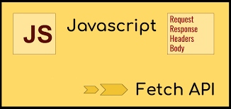

# Fetch API in JavaScript

## Introduction

The Fetch API is a modern interface for fetching resources (such as JSON data, images, and documents) across the network. It provides a simple and standardized way to make HTTP requests in JavaScript. In this beginner-friendly lesson, we'll explore the Fetch API, understanding its basic concepts and how it leverages Promises for asynchronous operations.

## What is Fetch?

Before diving into Fetch API, let's understand the concept of fetching data. When building web applications, we often need to retrieve data from servers or APIs. This is where the Fetch API comes into play. It allows us to make requests to servers, fetch data, and use it in our applications.

Title: Understanding APIs: Your Gateway to Interconnected Applications

## What is an API?

API stands for Application Programming Interface. Think of it as a messenger that allows different software applications to communicate with each other. Just like how you use a menu to order food at a restaurant, developers use APIs to request specific functionalities or data from other software services or platforms.

**How do APIs work?**

Imagine you have a smartphone with a weather app installed. This app needs to display the current weather forecast. Instead of developing its own weather prediction system from scratch, the app can make a request to a weather service's API, asking for the current weather data. The API then processes this request, fetches the relevant information from its database, and sends it back to the weather app. All of this happens seamlessly behind the scenes.

**Types of APIs:**

1. **Web APIs:** These are APIs accessed over the internet using HTTP protocols. They allow different web services to interact with each other. For example, social media platforms like Facebook and Twitter provide APIs that allow developers to integrate their services into other apps.

2. **Library APIs:** These APIs are sets of pre-written code that provide functionalities to developers. They are often packaged in libraries or software development kits (SDKs) and can be directly included in the developer's code. For instance, Python's standard library includes APIs for tasks like file manipulation and network communication.

3. **Operating System APIs:** These APIs enable applications to interact with the underlying operating system. They provide access to system resources such as files, memory, and hardware devices. Examples include the Windows API for Windows operating systems and the POSIX API for Unix-based systems.

**Why are APIs important?**

1. **Interoperability:** APIs enable different software systems to work together seamlessly, fostering interoperability and integration.

2. **Efficiency:** By leveraging APIs, developers can save time and resources by reusing existing functionalities rather than reinventing the wheel.

3. **Innovation:** APIs empower developers to create new and innovative applications by combining various services and functionalities.

### Understanding Promises

Promises are a fundamental concept in JavaScript for handling asynchronous operations. They represent a value that might be available now, or in the future, or never. Fetch API is built on top of Promises, making it easier to manage asynchronous code.

## How Fetch Works

When we use Fetch API, we initiate a request to a specific URL. This request is asynchronous, meaning it doesn't block the execution of other code. Instead, Fetch returns a Promise immediately, which resolves when the request is complete, either with the result or an error.



## Using Fetch

Now, let's see how we can use Fetch in JavaScript.

```javascript
fetch("https://jsonplaceholder.typicode.com/posts/1")
  .then((response) => {
    // Handle response
  })
  .catch((error) => {
    // Handle error
  });
```

In this example, we're fetching data from a URL using Fetch. The `.then()` method is used to handle the response once it's available, and `.catch()` is used to handle any errors that might occur during the request.

## Why Use Fetch?

You might wonder why we need Fetch API when we can already make requests using other methods like XMLHttpRequest (XHR). Fetch offers several advantages, including a simpler and more intuitive syntax, built-in support for Promises, and the ability to work with modern features like Streams and Service Workers.

## Conclusion

Understanding the Fetch API is crucial for building modern web applications that interact with servers and APIs. By grasping its basic concepts and leveraging Promises, you'll be able to fetch data efficiently and build dynamic applications that respond to user interactions and external data sources.
