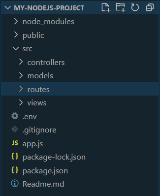

# Understanding Node.js with Express: Routes, Controllers, and Models

## What You Will Learn

In this lesson, you'll learn how to structure a Node.js application using Express.js, focusing on organizing routes, controllers, and models. We'll provide detailed explanations and examples, taking a step-by-step approach to help beginners understand the concepts better.

## Resources

- [Express Documentation](https://expressjs.com/)
- [Node.js Documentation](https://nodejs.org/en/docs/)
- [Knex Documentation](http://knexjs.org/)
- [pg Documentation](https://node-postgres.com/)

## What Is...

Express.js is a powerful framework for building web applications and APIs in Node.js. It simplifies web development by providing a minimalist yet feature-rich framework. By structuring your Express application with routes, controllers, and models, you maintain a clean and organized codebase, making it easier to manage and scale your project.

## Understanding the Structure

In an Express application, we organize our code into different modules for better maintainability and scalability. Here's a high-level overview of each component:

- **Routes**: Define the endpoints of your application and handle incoming requests.
- **Controllers**: Contain the business logic of your application, handling requests from routes, interacting with models, and sending responses to the client.
- **Models**: Represent your application's data structure and interact with the database.

## Practical Example

### Step-by-Step Implementation

Let's walk through the implementation step by step:

1. **Setting Up the Project**:

   Ensure you have Node.js and npm installed on your machine. Then, create a new directory for your project and initialize a new Node.js project:

   ```bash
   mkdir my-express-app
   cd my-express-app
   npm init -y
   ```

   Next, install some dependencies:

   ```bash
   npm install express pg knex
   ```

   - **Express**: Simplifies the process of building robust APIs and web applications.
   - **pg**: A Node.js library for interfacing with PostgreSQL databases.
   - **Knex**: A versatile SQL query builder for Node.js.

2. **Structuring Your Express Application**:

   

   Let's explore each component in detail:

   - **Routes**: Define the endpoints of your application. Express Router is used to define routes.

     **Express Router Example:**
     ./src/routes/usersRouter.js

     ```javascript
     const express = require("express");
     const router = express.Router();
     const userController = require("../controllers/usersController");

     // Define routes
     router.get("/", userController.getAllUsers);

     module.exports = router;
     ```

   - **Controllers**: Contain the business logic of your application.

     **Controller Example:**
     ./src/controllers/usersController.js

     ```javascript
     const usersModel = require("../models/usersModel");

     const getAllUsers = async (req, res) => {
       try {
         const data = await usersModel.getUsers();
         res.json(data);
       } catch (e) {
         console.log(e);
       }
     };

     module.exports = { getAllUsers };
     ```

   - **Models**: Represent your application's data structure and perform CRUD operations.

     **Model Example:**
     ./src/models/usersModel.js

     ```javascript
     const knex = require("knex");

     const knexConfig = {
       client: "pg",
       connection: {
         host: "localhost",
         user: "your_username",
         password: "your_password",
         database: "your_database",
       },
     };

     const db = knex(knexConfig);

     const getUsers = async () => {
       try {
         const users = await db.select("*").from("users");
         return users;
       } catch (error) {
         console.error("Error fetching users:", error);
         throw error;
       }
     };

     module.exports = {
       getUsers,
     };
     ```

3. **Integrating Routes, Controllers, and Models with Express**:

Once the routes, controllers, and models are defined, integrate them into your Express application:

**app.js**

```javascript
const express = require("express");
const userRoutes = require("./routes/usersRouter");

const app = express();
const PORT = process.env.PORT || 3000;

app.use("/users", userRoutes);

app.listen(PORT, () => {
  console.log(`Server is running on port ${PORT}`);
});
```

## Conclusion

Organizing your Express.js application with routes, controllers, and models is crucial for maintaining a clean and scalable codebase. By following a structured approach and separating concerns, you can create maintainable and scalable web applications with Express.js. Experiment with different patterns and practices to find what works best for your project as you continue to learn and grow.
