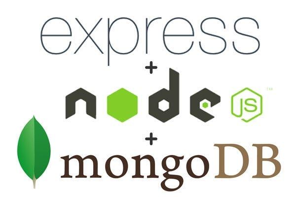

# Connecting and Communicating with MongoDB in Node.js

## What You Will Learn

In this comprehensive lesson, you will delve into connecting and communicating with MongoDB in a Node.js environment. You will learn about MongoDB basics, setting up a Node.js project, establishing a connection to MongoDB, performing CRUD operations, integrating MongoDB with Express routes, and comparing relational and non-relational databases.

## Resources

- **Links:**
  - [MongoDB Official Documentation](https://docs.mongodb.com/)
  - [Node.js MongoDB Driver Documentation](https://www.npmjs.com/package/mongodb)
- **Videos:**
  - [Connecting to MongoDB with Node.js](https://www.youtube.com/watch?v=bhiEJW5poHU)
  - [MongoDB CRUD Operations in Node.js](https://www.youtube.com/watch?v=_7UQPve99r4)

## What Is...

### Introduction to MongoDB



MongoDB is a leading NoSQL database known for its flexibility, scalability, and performance. Unlike traditional relational databases, MongoDB stores data in JSON-like documents, offering a dynamic schema that adapts to evolving data requirements.

- **Key Points:**
  - **Document-based storage model:** Allows for storing complex data structures in a single document.
  - **Flexibility:** Adapts to evolving data schemas and offers rapid development cycles.

### Setting Up the Node.js Project

Before diving into MongoDB integration, you need to set up a Node.js project using npm. This will ensure you have a structured environment to work with and manage dependencies effectively.

- **Steps:**

  1. **Installing Dependencies:** Ensure Node.js and npm are installed.
  2. **Creating a Node.js Project:** Initialize a new Node.js project using npm.

- **Code Example:**
  ```bash
  mkdir node-mongodb-project
  cd node-mongodb-project
  npm init -y
  ```

### Establishing a Connection to MongoDB

Establishing a connection to MongoDB is crucial for interacting with the database from your Node.js application. You will use the official MongoDB Node.js driver to create a client and connect to the MongoDB server.

- **Steps:**

  1. **Installing MongoDB Driver:** Install the MongoDB Node.js driver using npm.
  2. **Connecting to MongoDB:** Create a connection to the MongoDB server using MongoClient.

- **Code Example:**

  ```javascript
  // db.js
  const { MongoClient } = require("mongodb");

  const uri = "mongodb://localhost:27017"; // MongoDB connection URI
  const client = new MongoClient(uri);

  async function connectToMongoDB() {
    try {
      await client.connect(); // Connect to MongoDB
      console.log("Connected to MongoDB");
    } catch (error) {
      console.error("Error connecting to MongoDB:", error);
    }
  }

  module.exports = { connectToMongoDB, client };
  ```

### Performing CRUD Operations

CRUD (Create, Read, Update, Delete) operations are fundamental to database interactions. In this lesson, you will create a module to perform all CRUD operations on MongoDB collections.

- **Key Points:**

  - You'll cover all CRUD operations to provide a comprehensive understanding of MongoDB interactions.
  - Each operation is implemented as an asynchronous function to handle database operations efficiently.

- **Code Example:**

  ```javascript
  // data.js
  const { client } = require("./db");

  async function insertDocument(collectionName, document) {
    try {
      const database = client.db("mydatabase");
      const collection = database.collection(collectionName);
      const result = await collection.insertOne(document);
      console.log("Document inserted:", result.insertedId);
    } catch (error) {
      console.error("Error inserting document:", error);
    }
  }

  async function findDocuments(collectionName, query) {
    try {
      const database = client.db("mydatabase");
      const collection = database.collection(collectionName);
      const documents = await collection.find(query).toArray();
      console.log("Documents found:", documents);
      return documents;
    } catch (error) {
      console.error("Error finding documents:", error);
      return [];
    }
  }

  async function updateDocument(collectionName, filter, update) {
    try {
      const database = client.db("mydatabase");
      const collection = database.collection(collectionName);
      const result = await collection.updateOne(filter, { $set: update });
      console.log("Document updated:", result.modifiedCount);
    } catch (error) {
      console.error("Error updating document:", error);
    }
  }

  async function deleteDocument(collectionName, filter) {
    try {
      const database = client.db("mydatabase");
      const collection = database.collection(collectionName);
      const result = await collection.deleteOne(filter);
      console.log("Document deleted:", result.deletedCount);
    } catch (error) {
      console.error("Error deleting document:", error);
    }
  }

  module.exports = { insertDocument, findDocuments, updateDocument, deleteDocument };
  ```

- **Explanation:**
  - **Insert Document:** Inserts a new document into the specified collection.
  - **Find Documents:** Finds documents in the collection based on the provided query.
  - **Update Document:** Updates a document in the collection that matches the filter criteria.
  - **Delete Document:** Deletes a document from the collection based on the filter criteria.

### Integrating MongoDB with Routes in Express

Express is a popular web framework for Node.js, and integrating MongoDB with Express routes allows you to build dynamic web applications with database interactions.

- **Key Points:**

  - Set up an Express application to handle HTTP requests and responses.
  - Perform MongoDB operations based on incoming requests.

- **Code Example:**

  ```javascript
  // app.js
  const express = require("express");
  const { connectToMongoDB } = require("./db");
  const { insertDocument } = require("./data");

  const app = express();
  const port = 3000;

  connectToMongoDB();

  app.use(express.json());

  app.post("/create", async (req, res) => {
    const { collectionName, document } = req.body;
    await insertDocument(collectionName, document);
    res.send("Document created successfully");
  });

  app.listen(port, () => {
    console.log(`Server is running on port ${port}`);
  });
  ```

## Understanding...

### Relational vs. Non-Relational Databases

Understanding the differences between relational (e.g., PostgreSQL) and non-relational (e.g., MongoDB) databases is crucial for making informed decisions in database selection for applications.

- **Key Points:**

  - Relational databases follow a structured schema with predefined relationships.
  - Non-relational databases offer more flexibility with schemaless designs and horizontal scalability.

- **Comparison:**
  | Aspect | Relational (PostgreSQL) | Non-Relational (MongoDB) |
  | ----------------- | ------------------------------ | ------------------------------------------------------- |
  | **Structure** | Organized into tables | Stores data in flexible, JSON-like documents |
  | **Schema** | Requires a fixed schema | Flexible schema allows for dynamic data models |
  | **Scalability** | Vertical scaling | Designed for horizontal scaling and distributed systems |
  | **Transactions** | ACID transactions | Lacks full ACID transaction support |
  | **Relationships** | Foreign keys for relationships | Supports embedded documents and references |

## Conclusion

In this lesson, you learned about connecting and communicating with MongoDB in a Node.js environment. By understanding MongoDB basics, setting up a Node.js project, performing CRUD operations, integrating MongoDB with Express routes, and comparing relational and non-relational databases, you are now equipped with the knowledge to build robust and scalable applications using MongoDB and Node.js.
