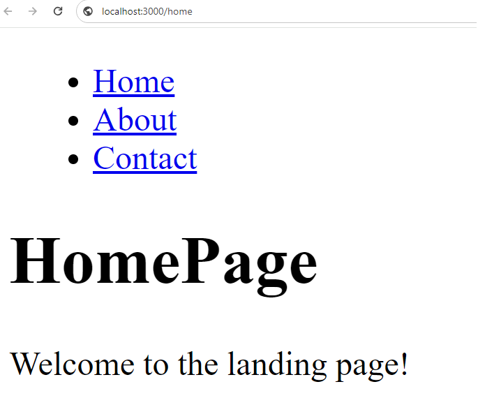
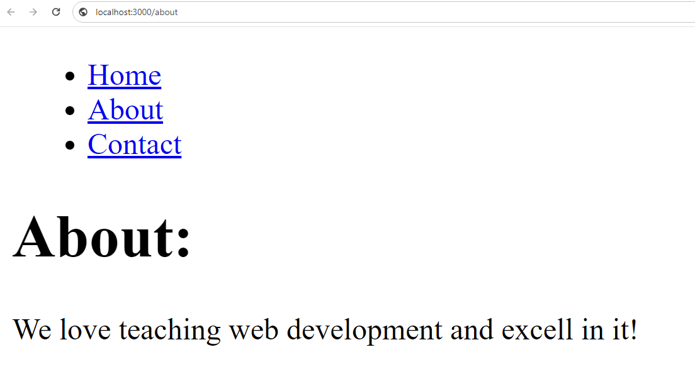
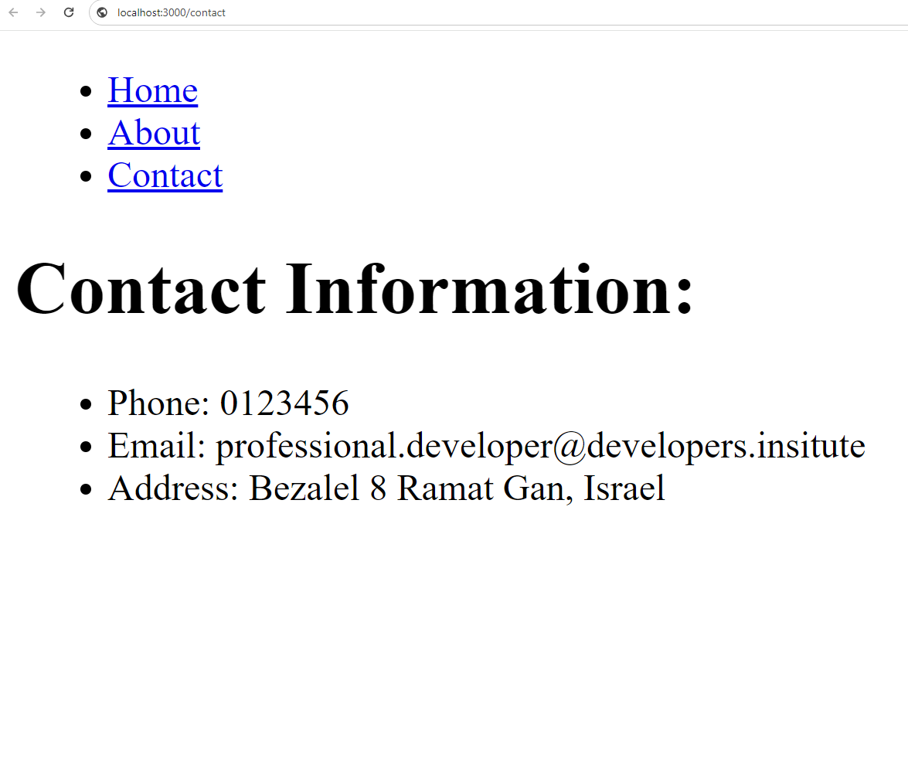
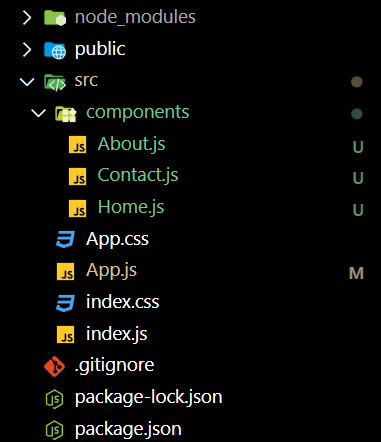

# React Router DOM

## What You Will Learn

In this lesson, you will learn about:

- React Router DOM and how to set it up
- Using React Router DOM for routing in React applications
- Setting a base URL for your application
- Custom hooks and their use in functional components
- Best practices for building scalable and maintainable React applications

## Resources

- [React Router DOM Documentation](https://reactrouter.com/)
- [Custom Hooks Tutorial](https://reactjs.org/docs/hooks-custom.html)
- [Best Practices for React](https://reactjs.org/docs/faq-performance.html)

## What Is React Router DOM?

React Router DOM is a library that provides routing capabilities for React applications. It enables you to manage navigation and URL changes in a declarative way.

## Understanding React Router DOM

### Setting Up React Router DOM

To use React Router DOM in your application, you need to install the `react-router-dom` package:

```bash
npm install react-router-dom
```

### Practical Example: Using React Router DOM

Here's an example of how to use React Router DOM in your application:

./src/Home.js

```jsx
export const Home = () => (
  <div>
    <h1>HomePage</h1>
    <p>Welcome to the landing page!</p>
  </div>
);
```

./src/About.js

```jsx
export const About = () => (
  <div>
    <h1>About:</h1>
    <p>We love teaching web development and excell in it!</p>
  </div>
);
```

./src/Contact.js

```jsx
export const Contact = () => (
  <div>
    <h1>Contact Information:</h1>
    <ul>
      <li>Phone: 0123456</li>
      <li>Email: professional.developer@developers.insitute</li>
      <li>Address: Bezalel 8 Ramat Gan, Israel</li>
    </ul>
  </div>
);
```

./src/App.js

```jsx
import React from "react";
import { BrowserRouter as Router, Routes, Route, Link } from "react-router-dom";
import Home from "./Home";
import About from "./About";
import Contact from "./Contact";

function App() {
  return (
    <div>
      <ul>
        <li>
          <Link to="/">Home</Link>
        </li>
        <li>
          <Link to="/about">About</Link>
        </li>
        <li>
          <Link to="/contact">Contact</Link>
        </li>
      </ul>
      <Router>
        {/* Wrapping the application with BrowserRouter */}
        <Routes>
          {/* Defining routes */}
          <Route path="/" element={<Home />} /> {/* Route for Home component */}
          <Route path="/about" element={<About />} /> {/* Route for About component */}
          <Route path="/contact" element={<Contact />} /> {/* Route for Contact component */}
        </Routes>
      </Router>
    </div>
  );
}

export default App;
```

##### When you click the Home link:



##### When you click the About link:



##### When you click the Contact link:



#### Explanation:

- `BrowserRouter` from `react-router-dom` wraps the entire application, enabling client-side routing.
- `Routes` component defines different routes for various components.
- `Route` component maps a specific URL path to a corresponding component.



### Setting Basename for the Application

You can configure your application to run underneath a specific basename in the URL.

#### Practical Example: Setting Basename

./src/App.js

```jsx
import React from "react";
import { BrowserRouter as Router, Routes, Route } from "react-router-dom";
import Home from "./Home";
import About from "./About";
import Contact from "./Contact";

function App() {
  return (
    <div>
      <ul>
        <li>
          <Link to="/">Home</Link>
        </li>
        <li>
          <Link to="/about">About Me</Link>
        </li>
        <li>
          <Link to="/Contact">Contact</Link>
        </li>
      </ul>
      <Router basename="/app">
        {/* Setting basename to /app */}
        <Routes>
          <Route path="/" element={<Home />} /> {/* Renders at /app/ */}
          <Route path="/about" element={<About />} /> {/*Renders at /app/about  */}
          <Route path="/contact" element={<Contact />} /> {/*Renders at /app/Contact */}
        </Routes>
      </Router>
    </div>
  );
}

export default App;
```

## Best Practices for React

When working with React, it's important to follow best practices to ensure your code is maintainable, scalable, and performant.

### Component Structure

Organize your components into a clear and logical folder structure, separating presentational components from container components. This promotes code reuse and easier code maintenance.

### Avoid Mutating State Directly

When updating state in React components, always use the appropriate setState function provided by React. Avoid mutating state directly to prevent unexpected behavior and bugs.

### Use PureComponent and Memoization

Optimize performance by using `PureComponent` for class components and `React.memo` for functional components. These higher-order components prevent unnecessary re-renders when the component's props haven't changed.

### Use PropTypes or TypeScript

To enforce type safety and catch potential bugs early, use PropTypes for prop validation in JavaScript projects or TypeScript for static type checking.

### Code Splitting

Improve loading performance and reduce bundle size by implementing code splitting. Use `React.lazy` and `Suspense` for lazy loading components and handling loading states.

## Conclusion

In this lesson, you explored advanced topics such as React Router DOM, custom hooks, and best practices for building React applications. By mastering these concepts and adhering to best practices, you will be well-equipped to develop scalable, maintainable, and performant React applications. Keep practicing and experimenting with React to maximize your potential as a React developer!
