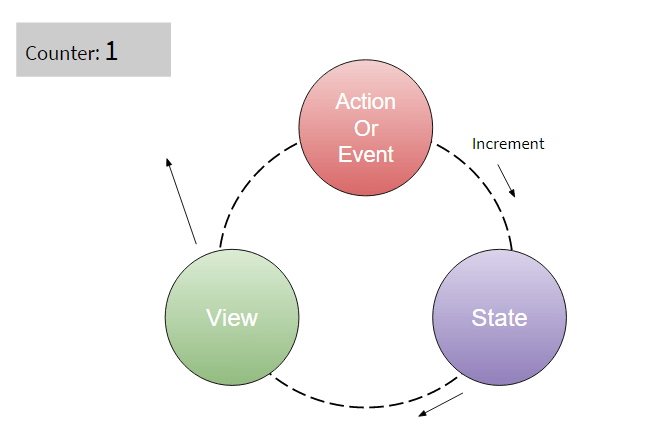
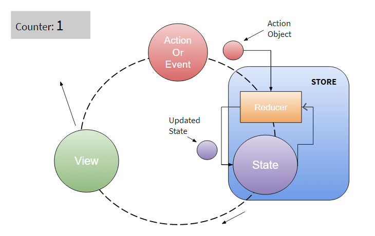

# Understanding Redux: Managing State in React

## Things We Will Learn:

- The problem of state management in complex React applications.
- Introduction to Redux and its core concepts.
- Implementing Redux to manage state effectively.
- Comparing React with and without Redux for state management.

## Video Links:

- [Introduction to Redux](https://www.youtube.com/watch?v=_shA5Xwe8_4&t=6s)
- [Implementing Redux in React](https://www.youtube.com/watch?v=9boMnm5X9ak&list=PLC3y8-rFHvwheJHvseC3I0HuYI2f46oAK)

## The Problem

Let’s say as a root component you have `app.js` file in your project, and in the component tree, the first layer contains 3 components and in the 2nd layer there are two child components of the 2nd component.

Here, you have fetched the data from an API and you save it in the state of the 2nd component. You can use this data state in child components by directly passing them downwards.

Now the problem occurs when the neighbor component which is 3 wants to access that data state.

So the problem is when multiple components that need to share and use the same state.

This can be solved by “lifting up” the state to the parent component. So you can lift state from the 2nd component to the `app.js` file, and then you can use this state in the 3rd component.

But that does not help always because in large application there are many states needed to be used in many different components, so it is not the best practice.

One way to solve this problem is to take state outside of the component tree and set it as centralized. So that any component in the tree can access and update the state without worrying about its hierarchy in the tree.

This is the basic idea behind Redux: a single centralized place to contain the global state in your application, and specific patterns to follow when updating that state.

You can use Redux to store the state and you can use it in any component without worrying about the hierarchy.

## React Working Without Redux

Consider this action as a trigger to update the state and when the state gets changed then view updates the UI with new state.

For a simple counter application, when we increment the counter value then increment event goes to state and state updates new value then, view re-renders UI based on the updated state.

## React Working With Redux

In Redux, there is a function called reducer. This reducer function takes two arguments, first is the state itself, and second is the action object.

Action object can have a type of action like increment and any data that wants to modify the state.

Now based on the previous state value and action type Redux calculates new value for state and updates it. These all things happen inside the Redux store, you can say it as any centralized database for state management.

## Conclusion

In conclusion, Redux offers a robust solution to manage the state in complex React applications. By centralizing the state management, Redux simplifies the process of sharing state among multiple components and ensures a predictable state management flow. While React can manage state locally within components, Redux becomes advantageous in larger applications with intricate state requirements.
