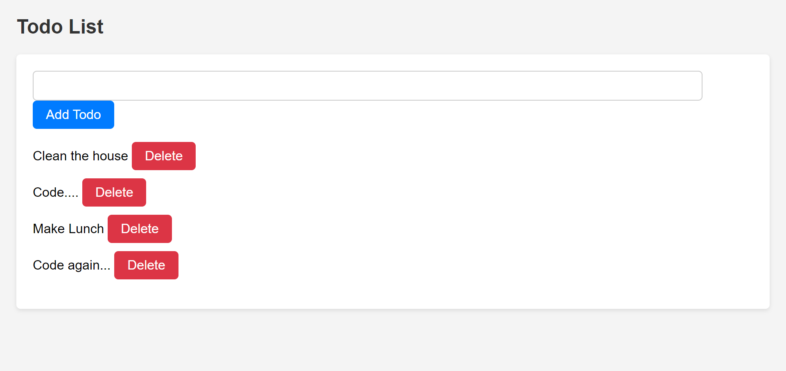

# Simplifying State Management with Redux Toolkit: A Todo List Application

## What You Will Learn

In this lesson, we'll explore how Redux Toolkit streamlines state management in React applications by providing simplified abstractions and utilities. We'll build a Todo List application to demonstrate how to use Redux Toolkit and organize your project structure effectively.

## Resources

- [Redux Toolkit Documentation](https://redux-toolkit.js.org/)
- [Redux Toolkit Tutorial - Redux Official](https://redux-toolkit.js.org/tutorials/basic-tutorial)
- [React Redux: A complete guide for beginners - Robin Wieruch](https://www.robinwieruch.de/react-redux-tutorial)

## Managing State Without Redux

Given a Todo List application, we can initially manage state without Redux. Let's see how we can handle state management using local component state and prop drilling.

### Parent Component

./src/components/ParentComponent.js

```jsx
import React, { useState } from "react";
import TodoList from "./TodoList";

const ParentComponent = () => {
  const [todos, setTodos] = useState([]);

  const addTodo = (newTodo) => {
    const newTodos = [...todos, { id: todos.length + 1, text: newTodo, completed: false }];
    setTodos(newTodos);
  };

  const toggleTodo = (id) => {
    const updatedTodos = todos.map((todo) => (todo.id === id ? { ...todo, completed: !todo.completed } : todo));
    setTodos(updatedTodos);
  };

  const removeTodo = (id) => {
    const filteredTodos = todos.filter((todo) => todo.id !== id);
    setTodos(filteredTodos);
  };

  return (
    <div>
      <h2>Todo List</h2>
      <TodoList todos={todos} addTodo={addTodo} toggleTodo={toggleTodo} removeTodo={removeTodo} />
    </div>
  );
};

export default ParentComponent;
```

In this component:

- We maintain the state of todos using `useState`.
- `addTodo`, `toggleTodo`, and `removeTodo` functions handle adding, toggling, and removing todos respectively.
- These functions are passed down to the `TodoList` component as props.

### TodoList Component

./src/components/TodoList.js

```jsx
import React, { useState } from "react";

const TodoList = ({ todos, addTodo, toggleTodo, removeTodo }) => {
  const [newTodo, setNewTodo] = useState("");

  const handleAddTodo = () => {
    addTodo(newTodo);
    setNewTodo("");
  };

  return (
    <div>
      <input type="text" value={newTodo} onChange={(e) => setNewTodo(e.target.value)} />
      <button onClick={handleAddTodo}>Add Todo</button>
      <ul>
        {todos.map((todo) => (
          <li key={todo.id}>
            <span onClick={() => toggleTodo(todo.id)} style={{ textDecoration: todo.completed ? "line-through" : "none" }}>
              {todo.text}
            </span>
            <button onClick={() => removeTodo(todo.id)}>Delete</button>
          </li>
        ))}
      </ul>
    </div>
  );
};

export default TodoList;
```

In this component:

- We utilize local component state (`useState`) to manage the state of the new todo (`newTodo`).
- The `TodoList` component receives `todos`, `addTodo`, `toggleTodo`, and `removeTodo` as props.
- State and handler functions are passed down through props.

By starting without Redux, we can understand the complexities involved in managing state and appreciate the simplicity Redux brings to the table. Let's explore how Redux can streamline state management in our Todo List application in the main lesson.

## With Redux : Project Structure

Let's organize our project structure to maintain a clean and scalable codebase:

```
/src
│
├── /app
│   ├── store.js               # Redux store setup
│   └── rootReducer.js         # Root reducer combining all reducers
│
├── /features
│   ├── /todos
│   │   ├── todosSlice.js      # Redux Toolkit slice for todos
│   │   └── TodoList.js        # TodoList component
│   │
│
└── App.js                      # Main application component
```

## Installation and Setup

First, let's install Redux Toolkit:

```bash
npm install @reduxjs/toolkit redux react-redux
```

## Using Redux Toolkit

Redux Toolkit simplifies Redux logic with its built-in utilities. Let's break down the components and concepts used in the project:

### Store

The Redux store holds the complete state tree of your application. It's responsible for dispatching actions, which trigger state changes, and maintaining the state.

#### `/app/store.js`

```javascript
import { configureStore } from "@reduxjs/toolkit";
import rootReducer from "./rootReducer";

const store = configureStore({
  reducer: rootReducer,
});

export default store;
```

**Explanation:** Here, we import `configureStore` from Redux Toolkit and set up our Redux store. We pass in the `rootReducer`, which combines all the reducers in our application, using `combineReducers`.

### Reducers

Reducers specify how the application's state changes in response to actions sent to the store. They are pure functions that take the previous state and an action, and return the next state.

#### `/app/rootReducer.js`

```javascript
import { combineReducers } from "redux";
import todosReducer from "../features/todos/todosSlice";

const rootReducer = combineReducers({
  todos: todosReducer,
});

export default rootReducer;
```

**Explanation:** In this file, we use `combineReducers` from Redux to combine multiple reducers into a single reducer function. Each reducer handles a slice of the application state.

### Redux Toolkit Slices

Redux Toolkit introduces the concept of slices, which are generated from reducers and actions. Slices contain the reducer logic and action creators bundled together.

#### `/features/todos/todosSlice.js`

```javascript
import { createSlice } from "@reduxjs/toolkit";

const todosSlice = createSlice({
  name: "todos",
  initialState: [],
  reducers: {
    addTodo: (state, action) => {
      state.push(action.payload);
    },
    toggleTodo: (state, action) => {
      const todo = state.find((todo) => todo.id === action.payload);
      if (todo) {
        todo.completed = !todo.completed;
      }
    },
    removeTodo: (state, action) => {
      return state.filter((todo) => todo.id !== action.payload);
    },
  },
});

export const { addTodo, toggleTodo, removeTodo } = todosSlice.actions;
export default todosSlice.reducer;
```

**Explanation:** Here, we create a slice using `createSlice` from Redux Toolkit. The slice contains the initial state (`[]` for todos), and reducers to handle adding, toggling, and removing todos. The `actions` object contains action creators for each reducer function.

### Wrap your application with the Provider:

Use the Provider component from React-Redux to wrap your application, passing in the Redux store you created.

#### index.js

```javascript
import React from "react";
import ReactDOM from "react-dom/client";
import App from "./App.jsx";
import { Provider } from "react-redux";
import store from "./store"; // Import your store
ReactDOM.createRoot(document.getElementById("root")).render(
  <Provider store={store}>
    <React.StrictMode>
      <App />
    </React.StrictMode>
  </Provider>
);
```

### Using Redux in Components

Redux Toolkit provides hooks like `useSelector` and `useDispatch` to interact with the Redux store in functional components.

#### `/features/todos/TodoList.js`

```javascript
import React from "react";
import { useSelector, useDispatch } from "react-redux";
import { toggleTodo, removeTodo, addTodo } from "./todosSlice";

const TodoList = () => {
  const todos = useSelector((state) => state.todos);
  const dispatch = useDispatch();
  const [newTodoText, setNewTodoText] = useState("");

  const handleAddTodo = (e) => {
    e.preventDefault();
    if (newTodoText.trim()) {
      dispatch(addTodo({ id: Date.now(), text: newTodoText, completed: false }));
      setNewTodoText("");
    }
  };

  return (
    <div>
      <form onSubmit={handleAddTodo}>
        <input type="text" value={newTodoText} onChange={(e) => setNewTodoText(e.target.value)} placeholder="Add a new todo" />
        <button type="submit">Add Todo</button>
      </form>
      <ul>
        {todos.map((todo) => (
          <li key={todo.id}>
            <span onClick={() => dispatch(toggleTodo(todo.id))} style={{ textDecoration: todo.completed ? "line-through" : "none" }}>
              {todo.text}
            </span>
            <button onClick={() => dispatch(removeTodo(todo.id))}>Delete</button>
          </li>
        ))}
      </ul>
    </div>
  );
};

export default TodoList;
```

**Explanation:** In this component, we use `useSelector` to extract the todos state from the Redux store. We also use `useDispatch` to get the `dispatch` function, which we use to dispatch actions like `toggleTodo` and `removeTodo` to update the state.

---

**The end project can look like this, but feel free to test out other styles and functionalities:**


## Conclusion

In this lesson, we explored how Redux Toolkit simplifies state management in React applications through its streamlined abstractions and utilities. Here's a summary of what we covered:

- **Store**: We learned about the Redux store, which holds the complete state tree of our application and dispatches actions to trigger state changes.

- **Reducers**: Reducers specify how the application's state changes in response to actions. We combined multiple reducers into a single root reducer using `combineReducers`.

- **Redux Toolkit Slices**: We introduced Redux Toolkit slices, which contain reducer logic and action creators bundled together. Slices streamline the process of creating reducers and actions.

- **Using Redux in Components**: We explored how to interact with the Redux store in functional components using hooks like `useSelector` and `useDispatch`. Components can extract state from the store and dispatch actions to update the state.

By building a Todo List application, we demonstrated the practical usage of Redux Toolkit in a real-world scenario. We organized our project structure effectively and used Redux Toolkit's features to maintain a clean and scalable codebase.

Experimenting with Redux Toolkit in your projects will not only enhance your understanding of state management but also empower you to build more maintainable and predictable React applications.
