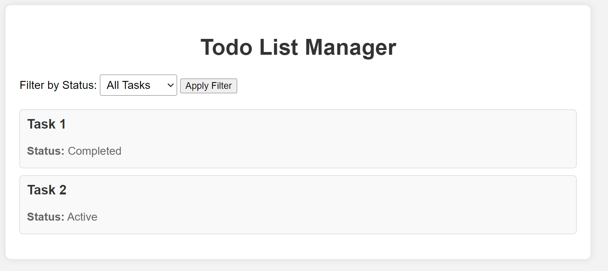

### 🌟 Exercise 1: Todo List Manager

**Overview**:
In this exercise, you'll build a simple todo list manager application using Redux Toolkit. The application allows users to add, remove, and filter tasks.

**Set up Redux Store**:

1. **Create Redux Store**: Begin by setting up a Redux store with necessary middleware and reducers to manage the todo list state. Redux Toolkit (`@reduxjs/toolkit`) will be used to simplify the setup process.

   - **Folder**: `src`
   - **File**: `store.js`
   - **Dependencies**: `@reduxjs/toolkit`

   **Explanation**: A Redux store acts as the single source of truth for the application state. It's essential for managing and updating the todo list data across different components.

**Define Initial State**:

2. **Set Initial State**: Define the initial state with an array of todos. Each todo should have properties like id, title, and completed. This initial state will be established using Redux Toolkit's `createSlice` function, which helps in reducing boilerplate code.

   - **Folder**: `src/features/todos`
   - **File**: `todosSlice.js`

   **Explanation**: The initial state provides a starting point for the todo list. By defining the state structure upfront, we ensure consistency and clarity in managing todos throughout the application.

**Selectors Creation**:

3. **Create Selectors**: Utilize `createSelector` from `@reduxjs/toolkit` to create selectors for filtering todos based on their completion status. Selectors play a crucial role in extracting and computing derived state from the Redux store, enhancing performance and maintainability.

   - **Folder**: `src/features/todos`
   - **File**: `todoSelectors.js`

   **Explanation**: Selectors abstract away the logic for filtering todos, making it easier to access specific subsets of data from the Redux store. This separation of concerns improves code readability and facilitates future enhancements.

**Component Implementation**:

4. **Implement TodoList Component**: Develop a React component named `TodoList` responsible for rendering the todo list. Components serve as the visual building blocks of the application, encapsulating UI logic and rendering data. Ensure React (`react`) and React Redux (`react-redux`) are installed.

   - **Folder**: `src/components`
   - **File**: `TodoList.js`
   - **Dependencies**: `react`, `react-redux`

   **Explanation**: The TodoList component plays a central role in displaying the todo items to users. By encapsulating this functionality within a reusable component, we promote code reusability and maintainability.

**UI Interaction**:

5. **Implement UI Interactions**: Incorporate UI interactions within the TodoList component to demonstrate selector functionality. This step involves connecting the Redux store with React components to enable dynamic updates based on user interactions.

   - **Folder**: `src/components`
   - **File**: `TodoList.js`

   **Explanation**: UI interactions allow users to interact with the todo list, such as marking tasks as completed or filtering them based on their status. By integrating Redux with React components, we enable seamless state management and UI updates.

**Test and Validate**:

6. **Test Functionality**: Validate the functionality by testing different scenarios, such as switching between different filters, adding or removing tasks, and verifying that the todo list updates correctly. Testing can be performed directly within React components or using testing frameworks like Jest or React Testing Library.

   **Explanation**: Testing ensures that the todo list manager behaves as expected under various conditions, enhancing reliability and user satisfaction. By thoroughly validating the functionality, we mitigate potential bugs and improve the overall quality of the application.

**End File Structure**:

After completing the exercise, the final file structure should resemble the following:

```
src/
├── components/
│   └── TodoList.js
├── features/
│   └── todos/
│       ├── todosSlice.js
│       └── todoSelectors.js
└── store.js
```

This structured organization ensures clarity and maintainability of the codebase, with components, reducers, selectors, and the Redux store neatly organized within the project directory.

**End Project Example**

