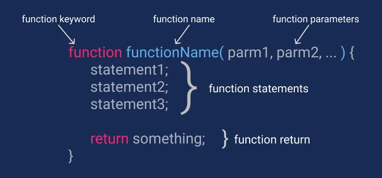

# Lesson: Advanced JavaScript Functions

**Table Of Contents**

1. Overview
2. Currying
3. Function Composition
4. Function binding
5. Decorators and Forwarding
6. Exercise

## 1. Overview

Welcome to the Advanced JavaScript Functions lesson! In this session, we will delve into higher-order functions, closures, and function composition, which are fundamental concepts in JavaScript programming. Understanding these concepts will greatly enhance your ability to write clean, efficient, and maintainable code.



Of course! Let's delve deeper into currying and function composition with multiple examples and explanations for each.

### 2. Currying

#### Definition and Examples

Currying is a functional programming technique where a function with multiple arguments is transformed into a sequence of functions, each accepting only one argument. This allows for partial application of the function, where you can fix some arguments ahead of time and generate a new function that takes the remaining arguments.

#### Example 1: Creating a Curried Function

Let's break down the `curry` function:

```javascript
function curry(fn) {
  return function curried(...args) {
    if (args.length >= fn.length) {
      return fn.apply(this, args);
    } else {
      return function (...nextArgs) {
        return curried.apply(this, args.concat(nextArgs));
      };
    }
  };
}
```

- The `curry` function takes another function `fn` as an argument.
- It returns a new function `curried`.
- Inside `curried`, it checks if the number of arguments passed is greater than or equal to the number of arguments expected by `fn`.
- If so, it invokes `fn` with the provided arguments.
- Otherwise, it returns a new function that takes the remaining arguments and recursively calls `curried`.

#### Example 2: Using the Curried Function

```javascript
function add(a, b, c) {
  return a + b + c;
}

const curriedAdd = curry(add);
const addTwoNumbers = curriedAdd(2);
const result = addTwoNumbers(3, 4); // Output: 9
```

- We define a function `add` that takes three arguments and returns their sum.
- We curry the `add` function using `curry`.
- We create a new function `addTwoNumbers` by fixing the first argument to `2`.
- Finally, we call `addTwoNumbers` with the remaining two arguments, resulting in the sum of `2 + 3 + 4`.

#### Why Do We Need Currying?

Currying provides several benefits:

1. **Partial Application**: Allows for partial application of functions, enabling the creation of specialized versions of functions with predefined arguments.

2. **Modularity and Reusability**: Encourages modularity by breaking down functions into smaller units, promoting code reuse and making it easier to compose functions together.

3. **Functional Composition**: Forms the basis for function composition, enabling the combination of functions to create new functionality.

### 3. Function Composition

#### Composing Functions

Function composition is the process of combining two or more functions to create a new function. This technique promotes code reuse, modularity, and readability by breaking down complex behaviors into smaller, more manageable units.

#### Example: Composing Functions

```javascript
function add(a, b) {
  return a + b;
}

function multiplyByTwo(num) {
  return num * 2;
}

function compose(f, g) {
  return function (x) {
    return f(g(x));
  };
}

const addAndMultiplyByTwo = compose(multiplyByTwo, add);
const result = addAndMultiplyByTwo(3, 4); // Output: 14
```

- We define two functions `add` and `multiplyByTwo`.
- We create a `compose` function that takes two functions `f` and `g` and returns a new function that composes them together.
- We compose `multiplyByTwo` and `add` to create a new function `addAndMultiplyByTwo`.
- Finally, we call `addAndMultiplyByTwo`, which first adds the two numbers and then multiplies the result by two, resulting in `14`.

#### Why Do We Need Function Composition?

Function composition offers several advantages:

1. **Code Reuse**: Enables reuse of existing functions to create new functionality without duplicating code.

2. **Modularity**: Breaks down complex behaviors into smaller, more manageable units, enhancing code maintainability and readability.

3. **Readability**: Promotes readable code by encouraging the creation of small, focused functions that can be easily understood and combined to achieve desired behavior.

By mastering currying and function composition, developers can write more flexible, modular, and maintainable code, leading to improved software design and development practices.

### 4. Function binding

Function binding in JavaScript allows you to control the value of `this` within a function. This is important because the value of `this` can change depending on how the function is called. By binding a function, you can explicitly specify what `this` should reference when the function is invoked.

### Key Concepts:

1. **Function.prototype.bind()**: The `bind()` method allows you to create a new function with a specified `this` context and, optionally, arguments that are passed to the new function when it's called.

   - **Syntax**: `function.bind(thisArg, arg1, arg2, ...)`
   - **Parameters**:
     - `thisArg`: The value to use as `this` when calling the new function.
     - `arg1, arg2, ...`: Optional arguments to pass to the new function.
   - **Return Value**: A new function with the specified `this` context and arguments.

2. **Constructor functions (`new`)**: When using the `new` keyword with a function, a new instance of an object is created, and the `this` context within the function refers to the new instance. This is an important part of object-oriented programming in JavaScript.

### Example of Function Binding:

Here's an example of using the `bind()` method to control the `this` context:

```javascript
// Object with a method
const obj = {
  name: "Alice",
  sayHello: function () {
    console.log(`Hello, my name is ${this.name}`);
  },
};

// Function with no specific `this` context
const sayHi = obj.sayHello;

// Without binding, `this` in sayHi will be undefined or global
sayHi(); // Output may vary (undefined or window/global context)

// Bind the function to `obj`, so `this` refers to `obj`
const boundSayHi = obj.sayHello.bind(obj);
boundSayHi(); // Output: "Hello, my name is Alice"
```

In this example, `obj.sayHello` is bound to `obj` using `bind()`, which ensures that `this` inside `sayHello` always refers to `obj`.

### Example of Constructor Function with `new`:

When a function is called with the `new` keyword, a new object is created, and `this` refers to that new object.

```javascript
function Person(name, age) {
  this.name = name;
  this.age = age;
  this.introduce = function () {
    console.log(`My name is ${this.name}, and I am ${this.age} years old.`);
  };
}

// Create a new instance of Person
const john = new Person("John", 30);

// `this` inside Person refers to the new object `john`
john.introduce(); // Output: "My name is John, and I am 30 years old."
```

In this example, `Person` is a constructor function. When we use `new Person(...)`, a new object is created, and `this` inside the constructor function refers to the new object.

### Key Takeaways:

- Use `bind()` to explicitly set the `this` context for a function. This is useful when you want a function to have a specific `this` context regardless of how it is called.
- The `new` keyword creates a new object instance and sets the `this` context to the new object within the constructor function.
- By understanding and controlling the `this` context, you can write more predictable and maintainable JavaScript code.

## 5. Decorators and forwarding

JavaScript functions are first-class citizens, meaning they can be passed around as arguments, returned as values from other functions, and manipulated like objects. This gives JavaScript exceptional flexibility, allowing you to forward calls between functions and decorate them. Let's explore how to use decorators and forwarding calls in JavaScript, including `call` and `apply` methods and the `new` keyword.

### Forwarding Calls between Functions

Forwarding calls between functions allows you to invoke one function and pass its context and arguments to another function.

- **`call()` and `apply()` methods**: Both `call` and `apply` methods allow you to invoke a function with a specified `this` context and arguments.

  - **`call()`**: Invokes a function with a specific `this` context and a list of arguments.
    - Syntax: `function.call(thisArg, arg1, arg2, ...)`
  - **`apply()`**: Invokes a function with a specific `this` context and an array of arguments.
    - Syntax: `function.apply(thisArg, [argsArray])`

#### Example of `call()` and `apply()`:

```javascript
function greet(greeting, name) {
  console.log(`${greeting}, ${name}!`);
}

const context = {};

// Using `call()` to invoke `greet` with a specific `this` context and arguments
greet.call(context, "Hello", "Alice"); // Output: "Hello, Alice!"

// Using `apply()` to invoke `greet` with a specific `this` context and an array of arguments
greet.apply(context, ["Hi", "Bob"]); // Output: "Hi, Bob!"
```

### Decorators

A decorator is a higher-order function that wraps another function, modifying its behavior. This is useful for adding functionality to an existing function without modifying its source code.

#### Example of a decorator:

```javascript
function logDecorator(fn) {
  return function (...args) {
    console.log(`Calling function with arguments: ${args}`);
    const result = fn(...args);
    console.log(`Function returned: ${result}`);
    return result;
  };
}

function add(a, b) {
  return a + b;
}

// Decorate the `add` function with `logDecorator`
const decoratedAdd = logDecorator(add);

// Calling the decorated function
decoratedAdd(2, 3); // Output: Calling function with arguments: 2,3
//         Function returned: 5
```

In this example, `logDecorator` is a decorator function that wraps the `add` function, logging the arguments and return value of `add`.

### Using `new` with Constructor Functions

When you use the `new` keyword with a constructor function, it creates a new object instance and sets the `this` context within the function to that new object.

#### Example:

```javascript
function Person(name) {
  this.name = name;
  this.introduce = function () {
    console.log(`Hello, my name is ${this.name}`);
  };
}

// Create a new Person instance using `new`
const person = new Person("Charlie");
person.introduce(); // Output: "Hello, my name is Charlie"
```

### Key Takeaways:

- **Forwarding Calls**: Use `call()` and `apply()` methods to invoke functions with a specific `this` context and arguments.
- **Decorators**: Use decorators to wrap a function with additional functionality, such as logging, caching, or error handling.
- **`new`**: Use the `new` keyword with constructor functions to create new object instances and set the `this` context within the function to the new object.

By leveraging these concepts, you can write more flexible and powerful JavaScript code, enabling you to modify and control functions in sophisticated ways.

## 6. Exercise: Practice with Higher-Order Functions

Now that you've learned about higher-order functions, closures, and function composition, it's time to put your knowledge into practice.

### Instructions:

1. Write a higher-order function called `operateOnArray` that takes an array and a function as arguments. This function should apply the given function to each element of the array and return the resulting array.

2. Use the `operateOnArray` function to perform the following operations on an array of numbers:

   - Double each number.
   - Square each number.
   - Calculate the sum of all numbers.

3. Test your `operateOnArray` function with different arrays and functions to ensure it works correctly.
