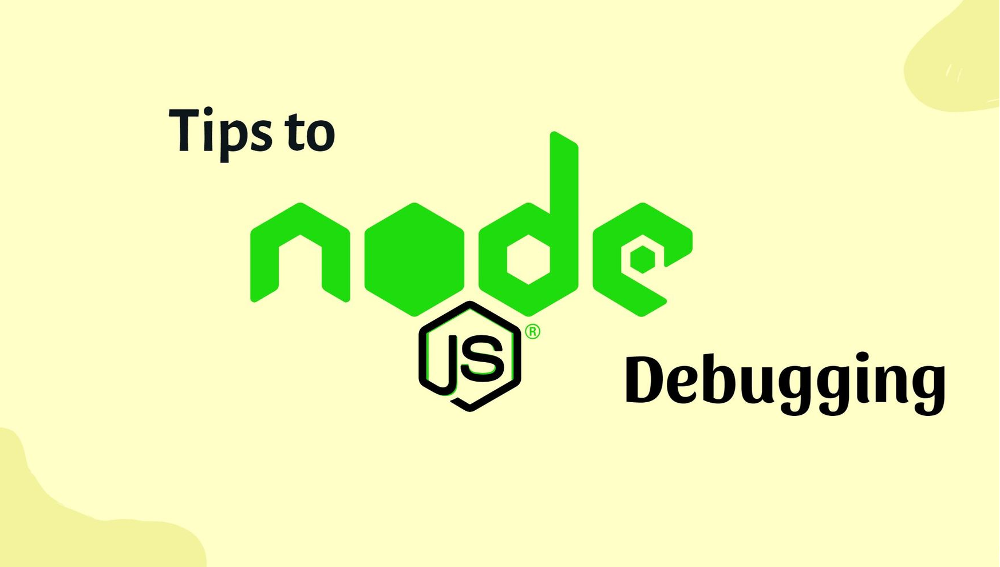

# Node.js Debugging

## What You Will Learn

In this lesson, you will explore various debugging techniques, tools, and best practices to help you effectively identify and resolve errors in your Node.js applications. Debugging is a crucial skill for developers, and mastering these techniques will significantly improve your development workflow and application reliability.

## Resources

- **Links:**
  - [Node.js Debugging Documentation](https://nodejs.org/en/learn/getting-started/debugging)
  - [VS Code Debugging Guide](https://code.visualstudio.com/docs/editor/debugging)
- **Videos:**
  - [Introduction to Node.js Debugging](https://www.youtube.com/watch?v=qz68RsESlp8&)

## What Is...

### Debugging in Node.js



Debugging is the process of identifying and fixing errors or bugs in software applications. It involves analyzing the code, understanding the behavior of the application, and applying appropriate solutions to resolve issues. Effective debugging techniques are essential for maintaining code quality and ensuring the reliability and performance of your Node.js applications.

## Understanding...

### Built-in Node.js Debugger

- **Using `console.log()`**

  - **Description:** `console.log()` is a basic method for debugging by printing messages to the console. It allows you to inspect variable values and track the flow of your code.
  - **Advantages:** Simple to use and provides immediate feedback on the state of your application.
  - **Example:** Debugging a variable using `console.log()`:
    ```javascript
    const name = "John";
    console.log("Name:", name);
    ```

- **Node.js Inspector**
  - **Description:** Node.js provides a built-in inspector that enables debugging using the Chrome DevTools. It allows you to inspect variables, set breakpoints, and step through code execution.
  - **Advantages:** Offers a powerful debugging interface with rich features for in-depth analysis of your application.
  - **Usage:** Start your Node.js application with the `--inspect` flag:
    ```bash
    node --inspect app.js
    ```
    Then, open Chrome and navigate to `chrome://inspect` to access the DevTools.

### Visual Studio Code (VS Code) Debugger

- **Setting Breakpoints**

  - **Description:** VS Code offers an integrated debugger that allows you to set breakpoints in your code. Breakpoints pause the execution of your program at specific lines, allowing you to inspect variables and analyze program state.
  - **Advantages:** Enables precise control over the debugging process and facilitates in-depth examination of code execution.
  - **Usage:** Set breakpoints by clicking on the line number in VS Code's editor panel. Start debugging by pressing `F5`.

- **Debugging Configuration**
  - **Description:** VS Code allows you to customize debugging configurations to suit your specific needs. You can configure launch configurations for different scenarios, such as launching the application in debug mode or attaching to a running process.
  - **Advantages:** Provides flexibility and control over the debugging environment, allowing you to tailor it to your requirements.
  - **Example:** Configuring a Node.js launch configuration in `launch.json`:
    ```json
    {
      "version": "0.2.0",
      "configurations": [
        {
          "type": "node",
          "request": "launch",
          "name": "Launch Program",
          "program": "${workspaceFolder}/app.js"
        }
      ]
    }
    ```

### Logging and Error Handling

- **Logging with Winston**

  - **Description:** Winston is a versatile logging library for Node.js that supports logging messages with various severity levels. It allows you to log messages to the console, files, databases, and more.
  - **Installation:** Install Winston using npm:
    ```bash
    npm install winston
    ```
  - **Advantages:** Facilitates centralized logging, making it easier to track and analyze application behavior.
  - **Usage:** Configure and use Winston to log messages:

    ```javascript
    const winston = require("winston");

    const logger = winston.createLogger({
      transports: [new winston.transports.Console(), new winston.transports.File({ filename: "error.log", level: "error" })],
    });

    logger.error("An error occurred!");
    ```

- **Error Handling with `try...catch`**
  - **Description:** `try...catch` blocks allow you to handle exceptions and errors gracefully in your code. They provide a structured way to capture and manage errors, preventing them from crashing your application.
  - **Advantages:** Improves application robustness by gracefully handling errors and preventing unexpected crashes.
  - **Example:** Implementing `try...catch` for error handling:
    ```javascript
    try {
      // Code that may throw an error
      throw new Error("An error occurred!");
    } catch (error) {
      console.error("Error:", error.message);
    }
    ```

## Practical Example

Here's an example showing how you can use different debugging techniques, including `console.log()`, Node.js Inspector, and VS Code debugger:

```javascript
// Include required modules
const express = require("express");
const winston = require("winston");
const app = express();

// Setting up Winston logging
const logger = winston.createLogger({
  transports: [new winston.transports.Console(), new winston.transports.File({ filename: "error.log", level: "error" })],
});

// Middleware to log incoming requests
app.use((req, res, next) => {
  logger.info(`Incoming request: ${req.method} ${req.url}`);
  next();
});

// Simple route for testing
app.get("/", (req, res) => {
  // Use console.log for debugging
  console.log("Request received");

  // Triggering an error for demonstration
  throw new Error("Test error");
});

// Error handling with try...catch
app.use((err, req, res, next) => {
  console.error("Error encountered:", err);
  res.status(500).send("An error occurred");
});

// Start the server
app.listen(3000, () => {
  console.log("Server running on port 3000");
});
```

## Conclusion

Debugging is a vital skill for developers to diagnose and fix issues in their Node.js applications. In this lesson, you explored various debugging techniques and tools, including `console.log()`, the Node.js inspector, and the VS Code debugger. Additionally, you learned about logging with Winston and error handling with `try...catch` blocks. By mastering these debugging techniques, you'll be equipped to tackle any challenges that arise during the development process and ensure the reliability and performance of your Node.js applications.
