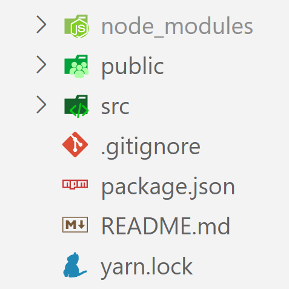

# React

## What You Will Learn

In this lesson, you will learn the fundamental concepts of React.js, including:

- Introduction to React.js
- Setting up a React development environment
- Understanding JSX (JavaScript XML)
- Working with Components
- Using Props (Properties)
- Managing State
- Working with Lifecycle Methods
- Conclusion and further learning

## Resources

- [Official React Documentation](https://reactjs.org/)
- [Create React App GitHub](https://github.com/facebook/create-react-app)
- [React Router Documentation](https://reactrouter.com/)

## What Is React?

React.js is a JavaScript library developed by Facebook for building user interfaces. It is known for its declarative and efficient approach to building complex UIs. React's core strength lies in its component-based architecture, which promotes reusability and modularity.

## Understanding React.js and JSX

### Getting Started with React.js

To start using React.js, you need to set up a development environment. The easiest way to get started with a React project is to use Create React App, a tool that sets up a React application with the necessary configuration.

To set up a React environment and create a new React application using create-react-app, follow these steps:

### Step 1: Install Node.js and npm

Ensure you have Node.js and npm installed on your computer. You can download and install them from the official Node.js website: [Node.js](https://nodejs.org/)

### Step 2: Create a New React Project

Open your terminal or command prompt and run the following command to create a new React application named "blog":

```bash
npx create-react-app blog
```

Note: The `npx` command is a package runner tool that comes with npm 5.2+.

### Step 3: Navigate to the Project Directory

Navigate to the newly created project directory by running:

```bash
cd blog
```

### Step 4: Start the React Application

Start the React application by running:

```bash
npm start
```

This command will start a development server and open a new browser window with your React application. If a new window doesn't open, you can manually open your browser and go to `localhost:3000`.


If you open the new project into your editor you will see:



- src folder : You need to put any JS and CSS files inside src, otherwise webpack won’t see them.

- public folder : You need to put any HTML files inside public

### Analyzing Files and Folders

#### README.md

- The `.md` extension denotes a Markdown file, which is a lightweight markup language used for formatting plain text.
- Often found in source code projects, README.md provides instructions and essential information about the project.
- When pushed to platforms like GitHub, README.md typically displays information about the repository's content.
- If you used create-react-app, your README.md should resemble the official create-react-app GitHub repository.

#### node_modules/

- This directory contains all installed node packages via npm.
- With create-react-app, several node modules are pre-installed.
- Generally, you don't directly interact with this folder as node packages are managed via npm commands.

#### package.json

- Displays a list of node package dependencies and project configurations.

#### package-lock.json

- This file instructs npm to specify exact node package versions.
- It's usually left untouched.

#### .gitignore

- Lists files and folders that shouldn't be added to the git repository.
- Commonly includes the node_modules/ folder to avoid sharing unnecessary dependencies.

#### public/

- Holds development files like `public/index.html`.
- `index.html` is displayed on localhost:3000 during development or on hosted domains.
- The default setup connects `index.html` with JavaScript from `src/`.

### Inside the `src/` Folder

- **src/App.js**: Focuses on implementing React components for your application.
- Initially, all necessary components are located here.
- Later, you might split components into separate files for better organization.

- **src/App.test.js**: Contains test files for your application.

- **src/index.js**: Acts as the entry point to the React world.
- Renders the `App` component within the `<div id="root">` in `index.html`.

```javascript
ReactDOM.render(
  <React.StrictMode>
    <App />
  </React.StrictMode>,
  document.getElementById("root")
);
```

#### The Render Function

- `ReactDOM.render()` function takes HTML code and an HTML element as arguments.
- Its purpose is to display specified HTML code within the specified HTML element.

For example:

```javascript
ReactDOM.render(<p>Working with React</p>, document.getElementById("root"));
```

- Renders the paragraph inside the `<div id="root">`.

#### Chrome Dev Tools

- Inspecting the elements in Chrome Dev Tools will show the rendered HTML inside the `<div id="root">`.

### JSX (JavaScript XML)

JSX is a syntax extension for JavaScript that allows you to write HTML-like code within JavaScript. It provides a more concise and readable way to describe the structure of your user interface.

**Example: JSX Syntax**

Here's a simple example of a React component written in JSX - we save our components in a components folder in the src:
./src/components/Greeting.js

```jsx
import React from "react";

function Greeting() {
  return (
    <div>
      <h1>Hello, React!</h1>
      <p>This is a JSX component.</p>
    </div>
  );
}

export default Greeting;
```

This functional component renders an `h1` and a `p` element wrapped in a `div`. JSX is transpiled to regular JavaScript function calls during the build process.

## Understanding Components and Props

### Components

Components are the building blocks of a React application. They encapsulate UI elements and their behavior, allowing you to create reusable and modular code. Components can be defined as functional components or class components.

- **Functional Components**: Functional components are a simpler way to define components in React. Here's an example:
  ./src/components/Greeting.js

  ```jsx
  import React from "react";

  function Greeting() {
    return <h1>Hello, World!</h1>;
  }

  export default Greeting;
  ```

- **Class Components**: Class components allow you to use lifecycle methods and manage state directly within the component:

  ```jsx
  import React, { Component } from "react";

  class Greeting extends Component {
    render() {
      return <h1>Hello, World!</h1>;
    }
  }

  export default Greeting;
  ```

### Props (Properties)

Props allow you to pass data from a parent component to a child component, enabling customization and reusability.

**Example: Using Props**

Here's an example of a functional component that receives a prop called `name`:
./src/components/Greeting.js

```jsx
import React from "react";

function Greeting({ name }) {
  return <h1>Hello, {name}!</h1>;
}

export default Greeting;
```

**Passing Props**

Here's an example of passing props from a parent component:
./src/App.js

```jsx
import React from "react";
import Greeting from "./Greeting";

function App() {
  return <Greeting name="React" />;
}

export default App;
```

## Conclusion

In this lesson, you've learned the fundamental concepts of React.js, including components, props and state management. These concepts form the foundation for building modern web applications with React.js. Continue to explore and practice these concepts to become proficient in React development.
