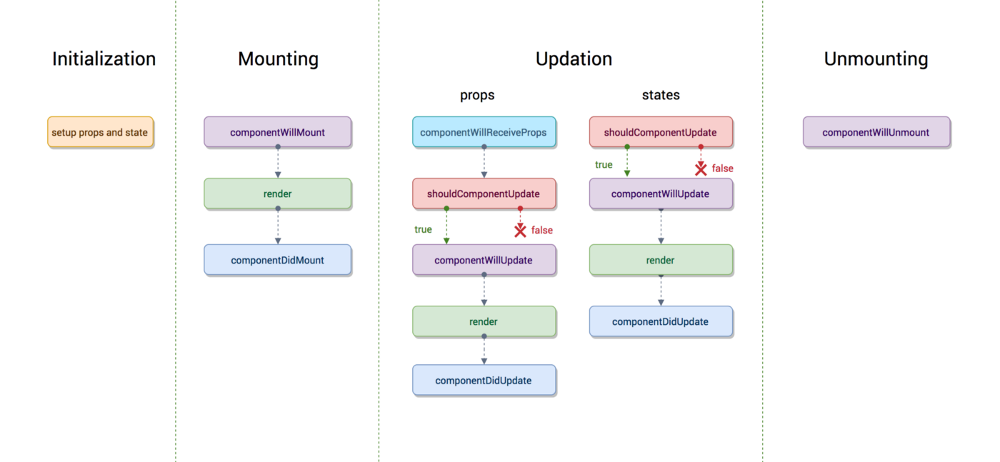

# React Lifecycle Methods

## What You Will Learn

In this lesson, you'll delve deeply into React lifecycle methods, understanding how components mount, update, and unmount in a React application. You will learn about the different phases of a component's lifecycle and how to utilize lifecycle methods effectively to manage state, perform side effects, and optimize performance.

## Resources

- [React Documentation: Components and Props](https://reactjs.org/docs/components-and-props.html)
- [React Lifecycle Diagram](https://projects.wojtekmaj.pl/react-lifecycle-methods-diagram/)
- [React Component Lifecycle Methods - A Deep Dive](https://www.taniarascia.com/understanding-the-component-lifecycle/)
- [Video: React Lifecycle Methods Explained](https://www.youtube.com/watch?v=J8rQWbLw9yY)

## What Are React Lifecycle Methods?

React components go through various phases during their lifecycle, from creation to destruction. Lifecycle methods are special methods that are automatically invoked at specific points in a component's lifecycle. These methods allow you to hook into these lifecycle events and execute custom logic.

## Understanding the Lifecycle Phases

### Mounting Phase

During the mounting phase, a component is being created and inserted into the DOM. Key lifecycle methods in this phase include:

- `constructor()`: Initializes the component's state and binds event handlers.
- `render()`: Returns the JSX representing the component's UI.
- `componentDidMount()`: Invoked after the component is mounted in the DOM. Ideal for performing asynchronous operations, such as fetching data from an API.

#### Example:

```jsx
class MountingDemo extends React.Component {
  constructor(props) {
    super(props);
    console.log("Constructor called");
  }

  componentDidMount() {
    console.log("Component did mount");
  }

  render() {
    console.log("Render method called");
    return <div>Hello, World!</div>;
  }
}
```

### Updating Phase

The updating phase occurs when a component's state or props change, triggering a re-render. Important methods in this phase include:

- `shouldComponentUpdate(nextProps, nextState)`: Determines whether the component should re-render. Allows for optimization by preventing unnecessary renders.
- `componentDidUpdate(prevProps, prevState)`: Invoked after the component's update is re-rendered. Useful for performing side effects after a state change.

#### Example:

```jsx
class UpdatingDemo extends React.Component {
  constructor(props) {
    super(props);
    this.state = { count: 0 };
  }

  shouldComponentUpdate(nextProps, nextState) {
    return nextState.count !== this.state.count;
  }

  componentDidUpdate(prevProps, prevState) {
    console.log("Component updated");
  }

  render() {
    return (
      <div>
        <p>Count: {this.state.count}</p>
        <button onClick={() => this.setState({ count: this.state.count + 1 })}>Increment</button>
      </div>
    );
  }
}
```

### Unmounting Phase

During the unmounting phase, a component is removed from the DOM. The main method in this phase is:

- `componentWillUnmount()`: Invoked just before the component is unmounted. Useful for cleanup tasks such as removing event listeners or cancelling timers.

#### Example:

```jsx
class UnmountingDemo extends React.Component {
  componentWillUnmount() {
    console.log("Component will unmount");
  }

  render() {
    return <div>Unmounting Demo</div>;
  }
}
```



## Practical Example

Let's create a simple React component that demonstrates the usage of lifecycle methods:

```jsx
class LifecycleDemo extends React.Component {
  constructor(props) {
    super(props);
    this.state = { count: 0 };
  }

  componentDidMount() {
    console.log("Component mounted");
  }

  componentDidUpdate() {
    console.log("Component updated");
  }

  componentWillUnmount() {
    console.log("Component will unmount");
  }

  render() {
    return (
      <div>
        <p>Count: {this.state.count}</p>
        <button onClick={() => this.setState({ count: this.state.count + 1 })}>Increment</button>
      </div>
    );
  }
}
```

In this example, we have a component `LifecycleDemo` that logs messages to the console during different lifecycle phases.

## Conclusion

Understanding React lifecycle methods is essential for building robust and efficient React applications. By utilizing lifecycle methods effectively, you can manage state, perform side effects, and optimize performance in your React components. Experiment with different lifecycle methods and explore their capabilities to enhance your React development skills.
