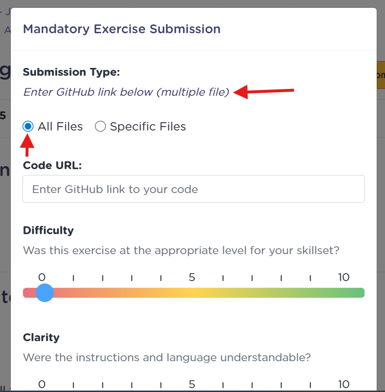
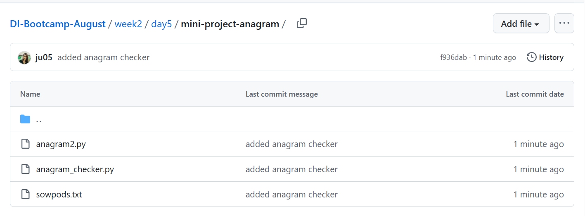
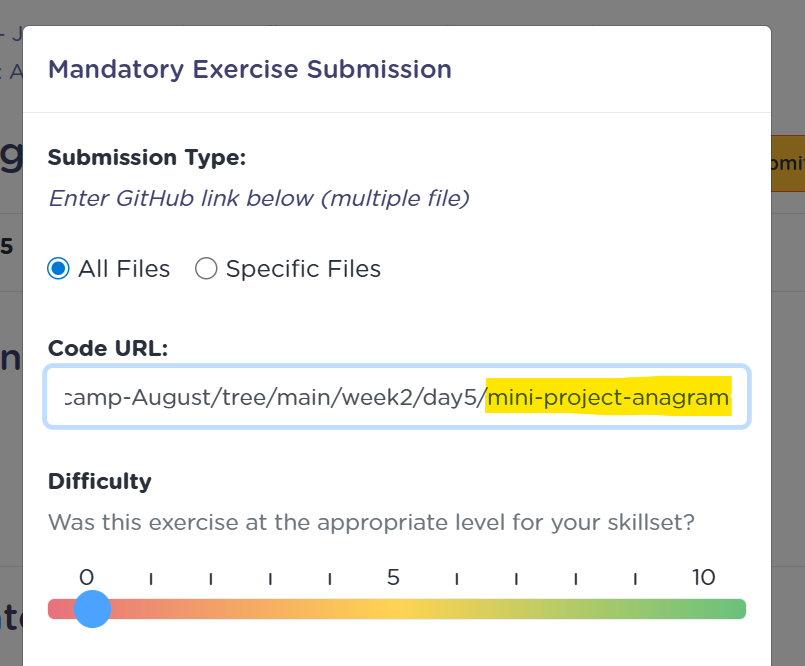

# 🧩 Submitting Exercises with Multiple Files

Some exercises require you to submit **a folder** (with multiple files) instead of a single file.
Follow the steps below to make sure your submission is correctly uploaded to Octopus.

---

## 🪜 Step-by-Step Guide

### 1️⃣ Click on the **Submit** button

When you finish your exercise, click on the **Submit** button under the exercise title.

---

### 2️⃣ Check the Exercise Specification

You’ll see a note saying that this exercise requires **multiple files**.
That means you need to share a **GitHub folder URL**, not a single file.



---

### 3️⃣ Copy Your GitHub Folder URL

Go to your GitHub repository and open the folder that contains all your exercise files.
Copy the **URL from your browser’s address bar** — it should look something like this:

```
https://github.com/yourusername/repo-name/tree/main/week2/day3/exercise-folder
```

Your view of the repository should be something like this:


---

### 4️⃣ Paste the URL in the Submission Window

Return to Octopus and **paste the GitHub folder link** in the submission box.
The end of the URL should be the name of the folder where all the files are:



---

### 5️⃣ Click on **Submit**

Once your link is pasted, click **Submit** to send your exercise for review.

---

✅ **That’s it!**
Your submission is now complete. The checker will open your GitHub folder to review all your files.

---

